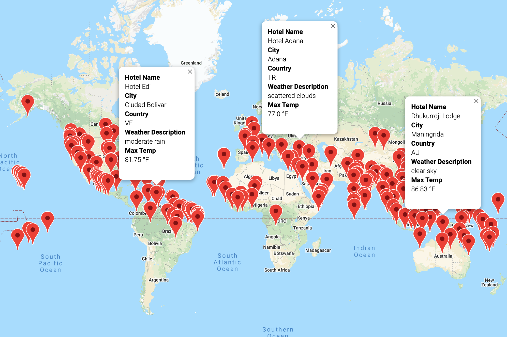
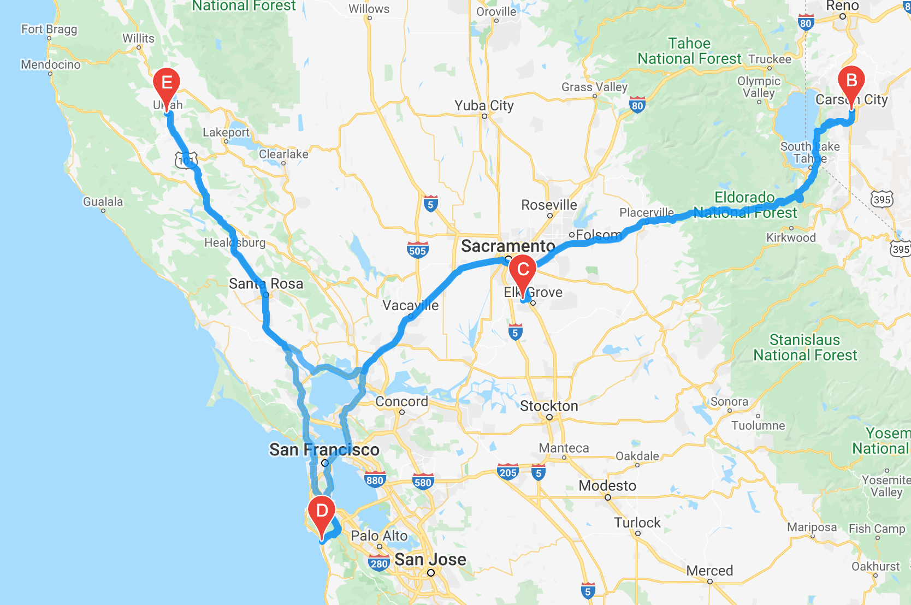

# WeatherPy

## Overview

The main purpose of this challenge is to collect, analyze and visualize weather data across cities worldwide and to give travelers a tool that allows them to chose their next travel destination based on weather conditions.

### Resources Utilized to Complete Analysis
* **CSV Files:** 
[Weather_Database.csv](Weather_Database/WeatherPy_Database.csv), 
[WeatherPy_vacation.csv](Vacation_Search/WeatherPy_vacation.csv)
* **Jupyter Notebook Files:**:
[Weather_Database.ipynb](Weather_Database/Weather_Database.ipynb), 
[Vacation_Search.ipynb](Vacation_Search/Vacation_Search.ipynb),
[Vacation_Itinerary.ipynb](Vacation_Itinerary/Vacation_Itinerary.ipynb)

* **Python**: Python v3.8.8, Dependencies: Pandas, Matplotlib, CitiPy, SciPy, Python Requests, APIs, JSON Traversals

## Main Stages

1. Collect the Data

2. Exploratory Analysis with Visualization

3. Visualize Travel Data

## Vacation Search
Based on traveler’s weather preferences.

### Sample Travel Destinations

## Vacation Itinerary 
Via Google Directions API:

